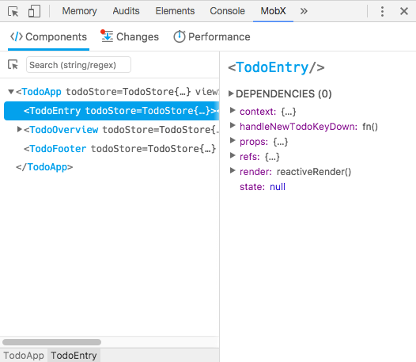
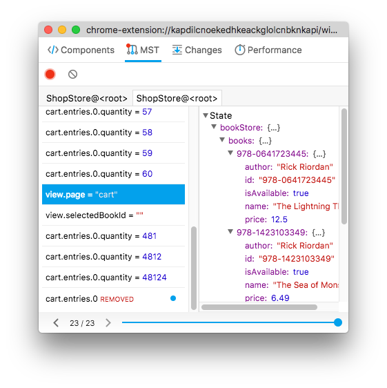

# mobx-devtools
This repository is home for:
* [MobX Developer Tools for **Chrome**](https://chrome.google.com/webstore/detail/mobx-developer-tools/pfgnfdagidkfgccljigdamigbcnndkod)
* [MobX Developer Tools for **Firefox**](https://addons.mozilla.org/en-US/firefox/addon/mobx-devtools/)
* [Standalone app](#standalone-app) for Safari, IE etc. 



#### Features

* Track changes in MobX observables
* MST support (see below).

#### mobx-state-tree
To allow inspecting MST root, do `npm install mobx-devtools-mst` and pass it to the function, exported as the default:
```js
import makeInspectable from 'mobx-devtools-mst';

const myStore = MyStore.create(/* ... */);

makeInspectable(myStore);
```



#### Standalone app

Install:
```sh
npm install --global mobx-devtools
```
Start: 
```sh
mobx-devtools
```


# Troubleshooting

### It doesn't work
Make sure that you are using [mobx](https://www.npmjs.com/package/mobx) 3.1.15 or higher and your app does not live inside an iframe. If that doesn't help, please [create an issue](https://github.com/mobxjs/mobx-devtools/issues/new) with detail about your environment.

### Performance & Components tabs [DEPRECATED].
Prefer use React Devtools extension for components tree and performance [discuss](https://github.com/mobxjs/mobx-devtools/issues/56#issuecomment-541896923)


# Hacking

Check the [HACKING.md](HACKING.md).
