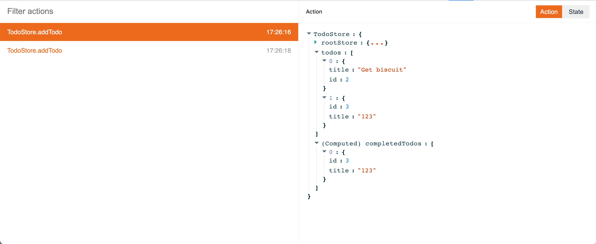
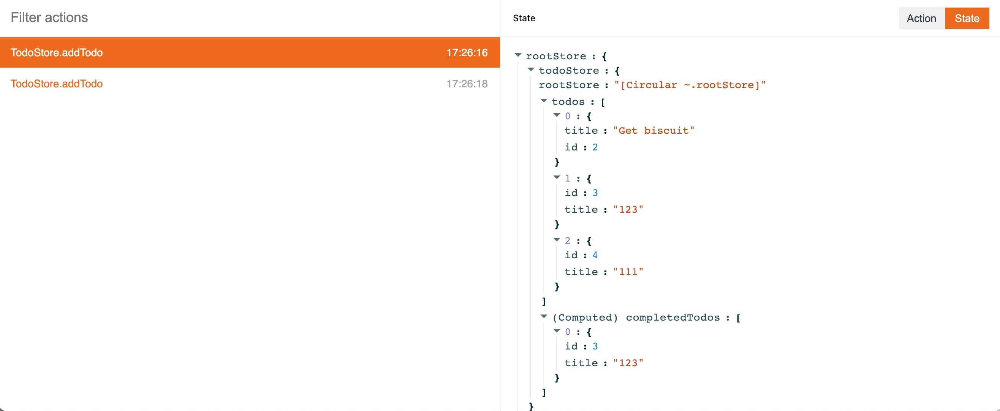

# MobX Devtools Pro

The official [MobX Devtools](https://github.com/mobxjs/mobx-devtools) enhanced version.

This repository is home for:

- MobX Developer Tools Pro(in review)

## MobX Devtools Pro vs [MobX Devtool](https://github.com/mobxjs/mobx-devtools)

| Features                                                 | MobX Devtools Pro | MobX Devtool |
| -------------------------------------------------------- | ----------------- | ------------ |
| Track action                                             | ✅                | ✅           |
| Computed view                                            | ✅                | ❌           |
| App stores view                                          | ✅                | ❌           |
| [MST](https://github.com/mobxjs/mobx-state-tree) support | ❌                | ✅           |

And MobX Devtools Pro has a better user experience.

## Screenshot

## Hacking

Check the [HACKING.md](HACKING.md).
