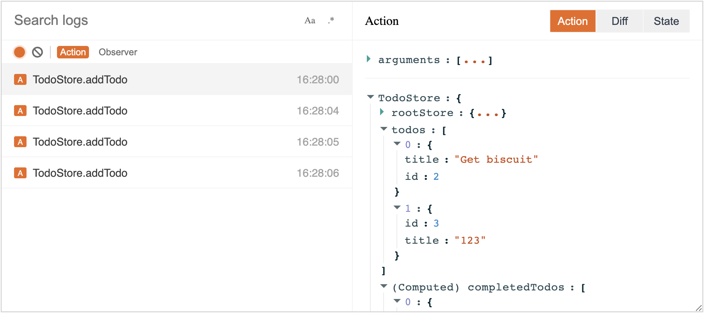
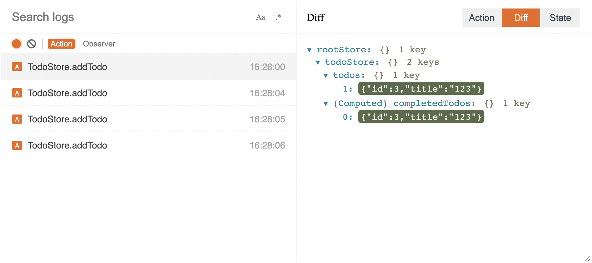
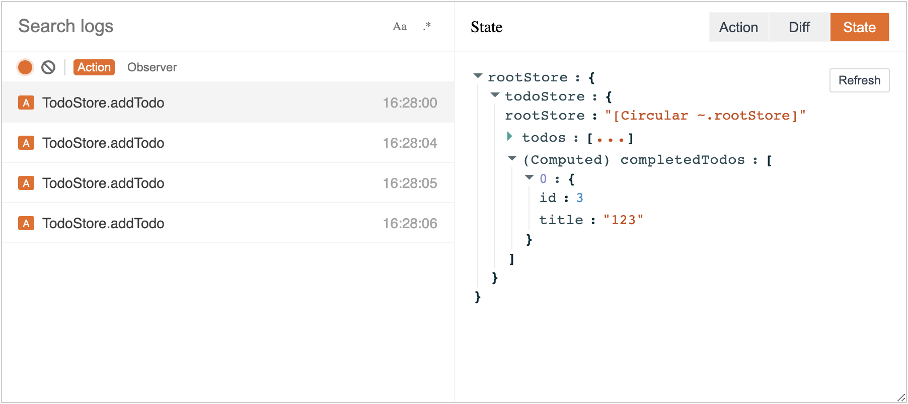

# MobX Devtools Pro

The official [MobX Devtools](https://github.com/mobxjs/mobx-devtools) enhanced version.

This repository is home for:

- [MobX Developer Tools Pro for Chrome](https://chrome.google.com/webstore/detail/mobx-developer-tools-pro/kbkofmkelombofknjlippaelfjhbpena)

## MobX Devtools Pro vs [MobX Devtool](https://github.com/mobxjs/mobx-devtools)

| Features                                                 | MobX Devtools Pro | MobX Devtool |
| -------------------------------------------------------- | ----------------- | ------------ |
| Track action                                             | ✅                | ✅           |
| Computed view                                            | ✅                | ❌           |
| State view                                               | ✅                | ❌           |
| Diff view                                                | ✅                | ❌           |
| Inspect mobx-react(mobx-react-lite) observers            | ✅                | ✅           |
| [MST](https://github.com/mobxjs/mobx-state-tree) support | ❌                | ✅           |

And MobX Devtools Pro has a better user experience.

## Usage

1. Install `@mobx-devtools/tools` package

```shell
npm i @mobx-devtools/tools
```

2. Inject app's stores for Diff and State features

```typescript
import { StoreA, StoreB } from './stores';
import { injectStores } from '@mobx-devtools/tools';

const storeA = new StoreA();
const storeB = new StoreB();

injectStores({
  storeA,
  storeB,
});

export const App = () => {
  // ...
};
```

3. Start your mobx debug tour!

## Screenshot

### Action



### Diff



### State



## Hacking

Check the [HACKING.md](HACKING.md).
