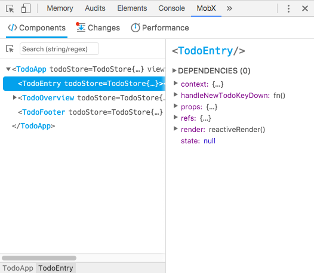
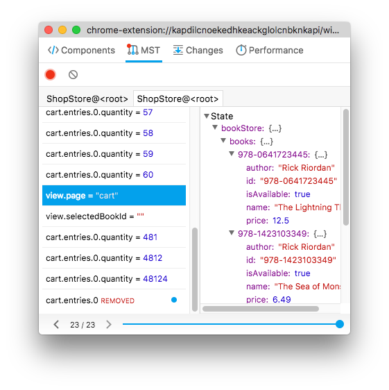

# MobX Developer Tools

[](https://github.com/mobxjs/mobx-devtools/actions/workflows/test.yml)

DevTools for debugging [MobX](https://mobx.js.org/) applications. Track changes to observables, inspect the dependency tree, and explore [mobx-state-tree](https://mobx-state-tree.js.org/) stores — all from your browser.



## Install

### Browser Extension

- [Chrome](https://chrome.google.com/webstore/detail/mobx-developer-tools/pfgnfdagidkfgccljigdamigbcnndkod) (Manifest V3, Chrome 88+)
- [Firefox](https://addons.mozilla.org/en-US/firefox/addon/mobx-devtools/) (Firefox 54+)

### Standalone App

For browsers without extension support (Safari, etc.):

```sh
npm install --global mobx-devtools
mobx-devtools
```

## Compatibility

- MobX 2.2+ through 6.x
- mobx-state-tree (any version)

## mobx-state-tree Support

To inspect MST stores, install the companion package and make your stores inspectable:

```sh
npm install mobx-devtools-mst
```

```js
import makeInspectable from 'mobx-devtools-mst';

const myStore = MyStore.create(/* ... */);
makeInspectable(myStore);
```



## Troubleshooting

**DevTools not connecting?** Make sure you are using [mobx](https://www.npmjs.com/package/mobx) 2.2.0 or higher and your app does not live inside an iframe. If that doesn't help, please [open an issue](https://github.com/mobxjs/mobx-devtools/issues/new) with details about your environment.

## Contributing

See [HACKING.md](HACKING.md) for development setup instructions.

## License

[MIT](LICENSE)
